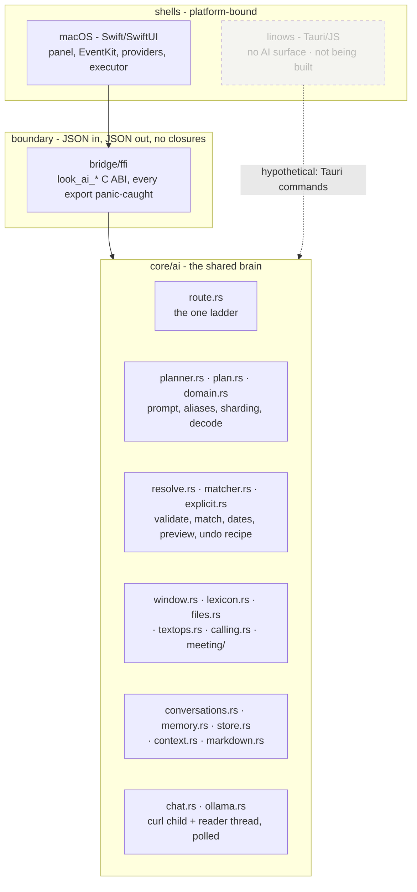
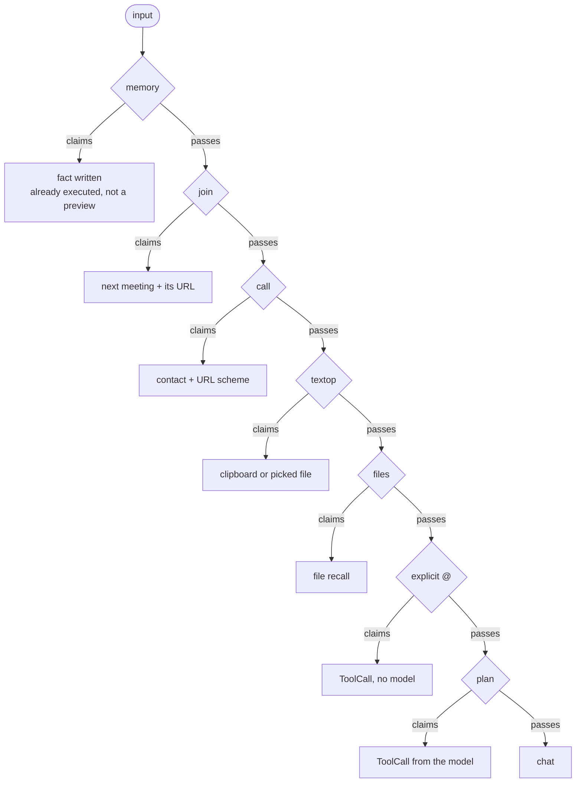
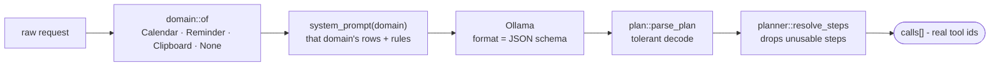
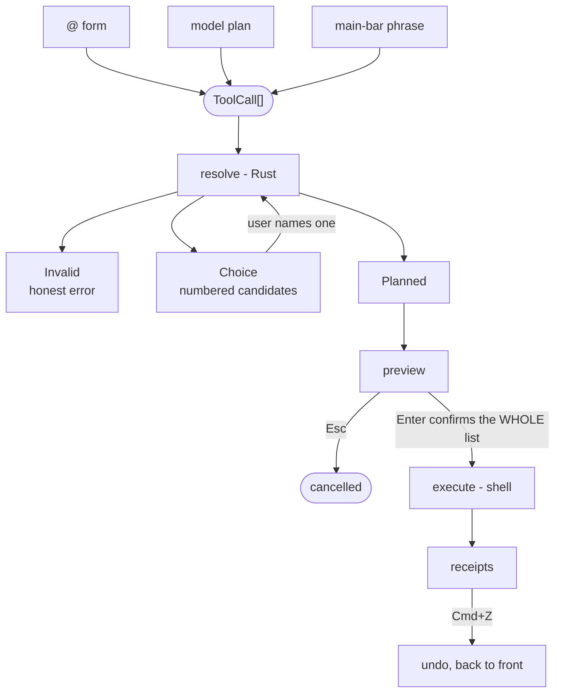
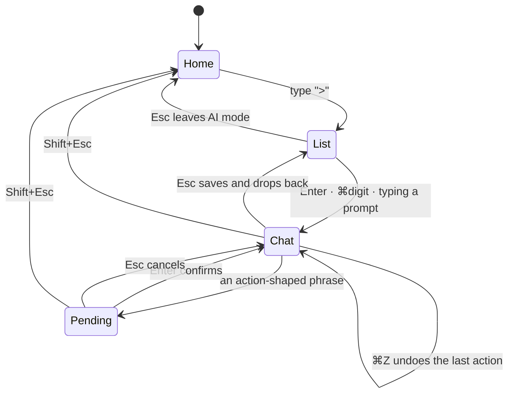

# AI architecture - as built

The stable core the AI surface is built on: how input is routed, how an intent
becomes an executable plan, how it executes and reverses, and where each piece
lives. Get these right and adding the Nth capability is a small change in one
place.

Scope: the shared Rust brain and the spine every producer converges on. The
macOS Calendar/Reminders backend that plugs into it is `ai-eventkit.md`.
Forward-looking direction, and the pillars that are not built yet, live in
`ai-vision.md`. User-facing behaviour and keys live in `user-guide.md` and
`features.md`.

> Supersedes the original Swift `ActionTool`/`ActionRegistry`/`AIValue` design,
> which was deleted when resolution moved to Rust.

## 1. Layers

The brain is Rust. The shell owns only what is platform-bound: the UI, the
system stores, and execution.

> **macOS is the only AI shell.** linows (the Tauri shell) has no AI surface
> and none is being built. It appears below only to show where a second shell
> *would* attach, because that seam is what forces the data-only boundary - not
> as in-flight work, and not something to build for speculatively.
>
> This is "not planned", not "refused". If you run Linux or Windows and want
> it, open an issue; demand is what would move it. But go in knowing two things
> that no amount of shell work fixes: the planner assumes a local model answering
> in about a second, which leans on Apple Silicon's unified memory more than it
> looks - the same model on a machine without a capable GPU or enough RAM may be
> too slow to type against; and there is no unified system calendar to write to
> on Linux, while Windows' `AppointmentStore` is heavily restricted. Chat and
> file recall would port cleanly. Calendar acting might never reach parity.



So the honest reason the boundary is data-only is not "the second shell needs
it" - there is no second shell. It is that a JSON-in/JSON-out core is testable
without a UI, keeps prompts and parsers in one place, and stays panic-caught at
the edge. The portability is a side effect worth keeping, not a commitment.

| Layer | Home | Why |
| --- | --- | --- |
| Routing, planning, resolution, matching, window grammar, lexicon, markdown, chat transport | `core/ai` (Rust) | One source of truth for prompts and parsers; unit-tested without a UI |
| C boundary | `bridge/ffi` | JSON in, JSON out; every export panic-caught |
| Pure Swift helpers (`DatePhrase`, `ScheduleWords`, `LocalHostCheck`, `OllamaCodec`) | `LauncherLogic` package | Foundation-only, unit-tested |
| EventKit, providers, controllers, SwiftUI | app target | Platform-bound |

The C surface (`bridge/ffi/src/lib.rs` is the source of truth):

```text
route      look_ai_route
plan       look_ai_plan_start / _poll / _cancel, look_ai_warm_planner
resolve    look_ai_resolve, look_ai_load_targets, look_ai_parse_explicit
chat       look_ai_chat_start / _poll / _cancel, look_ai_context_window
dates      look_ai_query_window, look_ai_day_phrase, look_ai_future_leaning
stores     look_ai_conversations_json, look_ai_conversation_upsert / _delete,
           look_ai_memory_command, look_ai_memory_context
misc       look_ai_markdown_segments_json, look_ai_textop_json,
           look_ai_is_referent, look_ai_is_file_query
```

Ollama health probing stayed Swift-side (`OllamaProvider.probe` +
`OllamaHealthCache`): it is a plain `GET /api/tags` plus a cache, and the shell
already needs the availability type for its UI. If a second shell ever
existed it would want its own equivalent rather than this FFI - which is the
reason not to promote it now.

**Build gotcha, and it fails silently.** The static library reaches the link
step through `-Wl,-force_load,.../RustBuild/liblook_ffi.a` in `OTHER_LDFLAGS`,
and Xcode does not treat a path inside a linker flag as a tracked build input.
Adding an FFI symbol fails loudly (undefined `_look_ai_*` at link time), but
changing existing Rust behaviour does not: cargo rebuilds the `.a`, nothing
triggers a relink, and the app keeps running the previous brain. Delete
`apps/macos/LauncherApp/RustBuild/liblook_ffi.a` (or `touch` any Swift file)
before rebuilding. Verify with `strings <DerivedData>/.../Look.debug.dylib |
grep <a-string-you-added>` - the **dylib**, not the `Look` shim, holds the code
in Debug. The real fix, not done: make the `.a` a tracked input, which changes
link behaviour for everyone and so deserves its own change.

## 2. The doctrine: three tiers, one typed output

Every AI surface follows the same ladder, and the important rule is that all
three tiers produce the *same* typed intent, so the model is just another
parser and can never reach an execution path the deterministic parser cannot.

1. **Deterministic grammar** - instant, runs per keystroke, works with AI off.
   The `@` form, file recall, text-op verbs, memory commands, the window
   grammar, calc, instant answers.
2. **Graceful relaxation** - when tier 1 triggered but found nothing, loosen
   deterministically instead of showing an empty panel (file search widens the
   time window, then drops unmatched terms; schedule questions fall back to a
   7-day window).
3. **Model interpretation** - schema-forced, cancellable, and emitting the same
   typed intent as tier 1. Never free-form text that gets re-parsed. Action
   planning runs while typing (on a 300ms idle) so the preview appears without
   pressing Enter; the *utility* intents (`recall`, `textop`) and the
   disambiguation list are Enter-only, because jumping the panel to file results
   or transforming the clipboard mid-keystroke would be hostile.

Two deliberate exceptions:

- **Memory is tier-1 only.** The model never writes durable facts, so a weak
  planner cannot pollute them. A "remember ..." phrasing the parser misses
  becomes chat, not a memory write.
- **Mutations keep the confirm gate.** Widening tier 3 is safe precisely
  because everything destructive still lands on a preview the user confirms,
  with undo after.

## 3. Routing (`core/ai/src/route.rs`)

ONE ladder, in one place, so precedence cannot drift as tiers are added.
Deterministic tiers run first, most precise first.



The shell calls `look_ai_route(memory_path, input, model_available, now)` and
switches on the returned decision. `plan` appears only when a capable model is
configured; otherwise the ladder ends at `chat`. The memory tier has already
executed when it answers - it is the handler, not a preview.

`join` and `call` sit above the planner for one concrete reason: asked to plan
"join the standup", a 7B model proposes ADDING an event called "the standup",
so a meeting that already exists turns into a confirm bar for a duplicate;
"call mom" fares the same way. Both are fixed grammars (`meeting::join_query`,
`calling::call_query`), need no model, and hand the shell a name to resolve
against the calendar or the address book - the shell owns those, since the
stores are platform code. Both end in the same place: a list of things to open,
and one URL.

## 4. The planner

The model emits JSON forced by a schema in Ollama's `format` field, so an
invalid shape is impossible rather than merely unlikely:

```json
{"steps": [{"tool": "<alias>", "params": {...}}]}
```



`steps` was an array from day one, so multi-step became a consumer change and
never a wire change. Every step executes; `map_snapshot` returns them as
`calls`.

Two different filters run at two different layers, and the difference matters:
here, a step whose ALIAS or PARAMS are unusable (an invented tool, a `move`
with no `when`) is dropped, because it never became a call at all. Later, in
the shell, a step that IS a call but cannot RESOLVE against real data (no
matching event) refuses the whole plan - see §6. So the core drops nonsense and
the shell refuses the merely-impossible; the preview always shows exactly what
will run.

Tool ids are 1-token aliases mapped to real ids in the planner, which keeps
generation short:

| alias | tool id | params |
| --- | --- | --- |
| `event` | `calendar.add_event` | `title` |
| `reminder` | `reminder.add` | `title` |
| `cancel` | `calendar.cancel_event` | `match` |
| `move` | `calendar.move_event` | `match`, `when` |
| `complete` | `reminder.complete` | `match` |
| `delete` | `reminder.remove` | `match` |
| `snooze` | `reminder.snooze` | `match`, `when` |
| `block` | `calendar.block_time` | `duration`, `when?`, `title?` |
| `recall` | `files.recall` | `terms?`, `types?`, `when?`, `location?` |
| `textop` | `clipboard.textop` | `instruction` |

`resolve_step` validates the per-tool requirements and returns `{tool, params}`
with real ids, or nothing when the step is unusable. Two tolerances worth
knowing: the mutate tools (`cancel`, `complete`, `delete`) accept `title` as a
stand-in when the model puts the subject there instead of `match`, and `recall`
is rejected unless at least one of its four facets is present (all four are
individually optional, but an empty recall is not a query).

Decoding is deliberately tolerant (`plan::parse_plan`). A schema does not stop
a small local model from adding a stray code fence after the value or dropping
the final brace, and a strict decode read both as declines: qwen3.5:4b scored
61% with one and 97% with the other. Junk after the first complete value is
ignored, unbalanced braces are closed, and a generation cut off mid-string is
still refused, because inventing the rest of a title is worse than declining.

### The prompt is sharded (`core/ai/src/domain.rs`)

One flat prompt listing every tool is what capped the vocabulary at ten: rules
added for one tool cost accuracy on the others, so nothing could be sharpened
and nothing new could be added. Instead, `domain::of` places a request into
`Calendar`, `Reminder`, or `Clipboard` from deterministic word signals, and the
prompt is built from that domain's rows plus that domain's rules. The prefilter
is conservative: an unplaceable request returns None and sees the whole table,
exactly as before, because a wrong narrow is unrecoverable while a missing one
only forgoes accuracy we did not have. `Files` is never returned; the strong
file shapes never reach the planner (§3) and the rest has no signal.

Two table properties are load-bearing:

- **Order is prompt order.** Alphabetizing the rows cost 3 points of tool
  accuracy on a 7B model. New rows go next to their domain siblings.
- **Rows are self-contained.** A row cannot refer to another row ("same rules
  as above"), because the other row may not be in this shard.

A row may also declare `requires`, a signal the raw request must carry for the
tool to be offered at all. `block` requires `resolve::has_duration_phrase`, so
"add gym session tomorrow 6am" is never even shown the tool it used to be
misfiled under. What is absent from the schema cannot be emitted, which is
stronger than a precondition written in prose.

Planning runs as a **cancellable session** (`look_ai_plan_start` / `_poll` /
`_cancel`) on the same curl transport as chat, so a superseded request is
actually killed rather than left to queue inside Ollama.

## 5. Resolution and the date seam

The shell passes platform data in; the core validates, matches through the
ambiguity gate, computes dates and previews, and returns a data-only outcome.
No closures cross the boundary.

```text
ResolveRequest { tool, params, now, events[], reminders[], resolved_when?, window_* }
   -> ResolveOutcome::Planned { preview_title, preview_detail, summary, subject, execute, undo }
                    | ::Choice { candidates[] }     // ambiguous match
                    | ::Invalid { message }         // missing/unusable input
```

`Execute` and `Undo` are data (`AddEvent`, `MoveEvent`, `SetReminderDue`, ...),
so the shell can perform and reverse an action without the core knowing
anything about EventKit. What the macOS shell does with them, and how
candidates get pushed back in: `ai-eventkit.md`.

Notable rules encoded here: never invent a clock time (a day with no time is an
all-day event, and no date at all is all-day today for events, undated for
reminders), all-day events don't block `block_time` slots, and adding an event
whose title already sits on that day appends "already on your calendar" to the
preview (warn, never block). Clock-time detection is lexical
(`has_clock_time`), not a guess.

**The core never does date math on natural phrases.** The shell resolves them
(macOS: `NSDataDetector`, which is excellent at day+time combinations) and
passes `resolved_when` back in. Two refinements:

- `window::day_phrase` is the shared-lexicon fallback for phrases the detector
  can't read ("this week wed", "last fri"), so an abbreviation means the same
  day wherever it is parsed.
- When both resolve, the **named day wins and the detector supplies the clock
  time**: "tue 9am" typed on a Monday is Tuesday 09:00, not today.

`window::future_leaning` nudges a bare clock time that already passed to the
next day; a phrase naming a day or month is respected as-is.

## 6. The execution spine

Every producer converges on the same path.



A plan is a LIST. One step for most requests, several for a compound one
("cancel the dentist and move lunch to 1pm"), and the whole list is confirmed
with one Enter and undone as a unit. Four rules keep that safe:

- **Every step must resolve, or none is offered.** A plan whose step cannot be
  resolved against real data is refused naming the step ("Step 2: no matching
  event"), never previewed as the half that worked. (Distinct from §4's
  dropping of malformed steps, which happens before a call exists.)
- **Ambiguity in a compound plan is refused, not queued.** Disambiguating one
  step of several would need a queue of questions; the user is asked to name
  that step precisely instead.
- **Execution stops at the first failure** and says which step, keeping the
  receipts of the steps that already ran - so undo reverses what actually
  happened rather than pretending all or nothing did.
- **Undo runs back to front**, reporting partial failure ("Undo failed for 1 of
  3 steps") rather than stranding the rest.

Two confirm surfaces, one spine:

- **AI panel**: a pending bar; Enter confirms, Esc cancels.
- **Main bar**: the plan renders as the first, selected result row, and the
  visible row *is* the confirmation - one Enter runs it, ⌘Z undoes. Styling per
  tool (icon, type badge, verb) comes from `AIActionAppearance`, so a new tool
  is one table entry, not new row code. A COMPOUND plan is not offered here:
  one row cannot confirm several actions, so Enter escalates to the AI panel's
  multi-step bar instead of running just the first step.

## 7. The `>` session

`>` is a MODE, not a per-message prefix: typing it consumes the prefix and
enters AI mode; every message after is AI input until Esc leaves. It owns the
panel area the way command mode and translation do.



Esc is a three-step ladder, and Shift+Esc skips it from anywhere.
Cmd+Space (hide/recall) suspends: mode and conversation both survive.

**Three producers, one spine.** The explicit `@` form (`>add lunch @ 1pm`) is a
deterministic parser, instant, no model, and it handles ONLY that delimited
form - it never guesses at natural language. Natural-language actions go to the
planner. Anything the planner declines becomes a chat turn on Enter. With no
capable planner configured, the `@` form runs in lenient mode (verbatim title,
date resolved from the whole phrase) and chat falls back to the selected
provider's single-turn stream, so `>` never dead-ends.

**Conversations.** One human-readable JSON file,
`~/Library/Application Support/Look/ai-conversations.json`, upserted
incrementally as items complete. Crash-safe for real: writes go to a temp file
and rename, and a file that fails to parse is moved aside as `.corrupt` rather
than being silently overwritten with an empty list. Bounds: 20 conversations,
last 60 items each. The model context per turn is a TOKEN budget, not a fixed
count - the newest turns that fit ~2500 tokens (`core/ai/src/context.rs`), so a
long chat stays coherent without a summarizer and an old conversation resumes
with bounded weight. Performed actions ride along as `[Done: ...]`, so "what
did I just add?" works.

**Markdown** is segmented by `core/ai/src/markdown.rs` (fenced code split from
prose; prose gets inline markdown via `AttributedString(markdown:)`).
Deliberately not a full engine, no third-party dependency. Parsed ONCE, when
the answer settles: the parse is an FFI call plus a full-text scan, so running
it per streamed token was quadratic work on the main thread. Mid-stream renders
as plain text, which also avoids styling half-written code fences.

### The latency contract

Speed is priority one. The levers, measured on qwen2.5-coder:7b:

- **The model emits only intent + a clean title** (~15-20 tokens). Dates are
  extracted from the raw query in code, never by the model.
- **Static system prompt** (never includes the date), so Ollama's prompt-prefix
  cache eliminates reprocessing (~2.3s -> ~0.15s).
- **Warm-up primes model + prompt cache** when a `>` query starts, throttled.
- **Single-shot planning**, no repair loop: the fields a repair round could fix
  no longer come from the model.
- **300ms idle before planning**, and an in-flight call is genuinely killed on
  the next keystroke, so superseded requests never queue ahead of the one the
  user is waiting for.
- `keep_alive: 30m` holds the model resident; `num_predict` caps runaway output.

Measured: plan ~0.9-1.0s warm, non-action decline ~0.4s, `@` form 0ms.

## 8. The provider seam (`AIQueryProvider`, `AIRequest.swift`)

Adding a provider means conforming to two members and nothing else:

```swift
func respond(messages: [AIMessage], options: AIGenerationOptions) -> AsyncThrowingStream<String, Error>?
var contextTokens: Int { get }
```

`AIMessage` keeps roles; `AIGenerationOptions` states needs in terms every
provider can answer in its own vocabulary (`maxOutputTokens`,
`expectedPromptTokens` as a HINT, temperature, timeout) with three profiles:
`.answerCard`, `.chat`, `.document(promptCharacters:)`. Ollama's dialect lives
in exactly one tested function, `ollamaJSON(contextCeiling:)`, which omits
`num_ctx` when the request fits the daemon's 4096 default, doubles once when it
does not, and clamps to the provider's declared ceiling. A new provider writes
its own translation; it never edits shared code.

`respond` has a default that flattens to `answer(query:)`, so a provider that
has not been taught roles still behaves as it does today. `contextTokens`
defaults to a conservative 4096, so an undeclared provider under-promises and
the attachment budget warns early rather than letting a prompt be truncated.

**Known caveat, deliberate:** the Ollama path does NOT call `provider.respond`.
`ChatSessionController` talks to the Rust transport directly because
cancellation lives there (session id + `aiChatCancel`), which an
`AsyncThrowingStream` alone does not express. It uses the same `ollamaJSON`
translation, so there is no second dialect, but Ollama does have two entry
points. Collapse them when the streaming interfaces converge - until then, a
change to generation options must be made in `AIGenerationOptions` (both paths
read it) and never inline at a call site.

## 9. Measuring it (`core/ai/examples/plan_eval.rs`)

Prompt and lexicon changes are only safe if they are measured: adding a
`duration` param once destabilized classification badly enough that adds fell
through to chat, and nothing caught it. The eval runs a fixture corpus through
the real ladder (`route_json`, then the real planner body for whatever reaches
the model) and scores route, tool, and params separately.

```text
cargo run -p look-ai --example plan_eval                        # ~/.look/config model
cargo run -p look-ai --example plan_eval -- --model qwen3.5:9b
cargo run -p look-ai --example plan_eval -- --routes-only       # no model, instant
cargo run -p look-ai --example plan_eval -- --min 85            # exit 1 below the bar
```

Corpus: `core/ai/fixtures/planner_eval.jsonl`, one JSON case per line
(`input`, `route`, `tool`, `params`, `note`). A `~value` param asserts a
normalized substring, so defensible title phrasings pass. Fixtures state
**desired** behaviour, so a failing case is a real gap whether it sits in the
prompt or in the ladder. Adding a tool means adding its cases first.

**Never change `SYSTEM_PROMPT`, the lexicon, or the alias table without running
this.** Baseline at 77 cases (61 model), Aug 2026, before and after the shard
work - the corpus has grown since:

| Model | Tool (flat) | Tool (sharded) | Params | p50 |
| --- | --- | --- | --- | --- |
| qwen2.5-coder:7b | 77% | **88%** | 100% | 0.9s |
| qwen3.5:4b | 75% | **97%** | 100% | 2.0s |
| qwen3.5:9b | 90% | **91%** | 100% | 3.7s |

Params scoring 100% while tools miss is the standing shape: slot extraction is
easy, tool choice is not. A general 4B instruct model beats both a 7B coder
model and a 9B one here, which is why qwen3.5:4b is the default; the coder
model's remaining misses are all bare adds ("coffee with mark on thursday")
that it declines.

Two prompt lessons the corpus paid for, both counterintuitive enough that they
would not have survived a vibe check: sharpening a TOOL LINE (spelling out what
"block" requires) lost 3 points by destabilizing unrelated tools, while the
same words as a DOMAIN RULE cost nothing, and a clock-time fallback in the
prefilter looked obviously right and moved nothing. Change one thing, measure,
keep or revert.

The first bug the corpus caught: `files::parse` triggered on any file-type
word, so "cancel the pdf review meeting" was claimed by file recall and the
planner never saw it. `files::is_scheduling` now vetoes a recall when a
schedule noun appears anywhere, when the opening verb is scheduling-only
(`is_schedule_verb`), or when a reschedule verb is paired with a named day.
File-capable verbs are deliberately excluded from that list, so "delete the
pdfs i downloaded yesterday" is still recall.

## 10. Testing

Everything on the brain side is a Rust unit test: routing, resolution,
matching, the ambiguity gate, date computation, previews, and undo recipes
(`cargo test -p look-ai`), plus the planner eval above. That is deliberate -
the platform stores cannot run unattended, so the logic worth testing was moved
off them. What is left in the shells is thin enough to smoke-test by hand.
