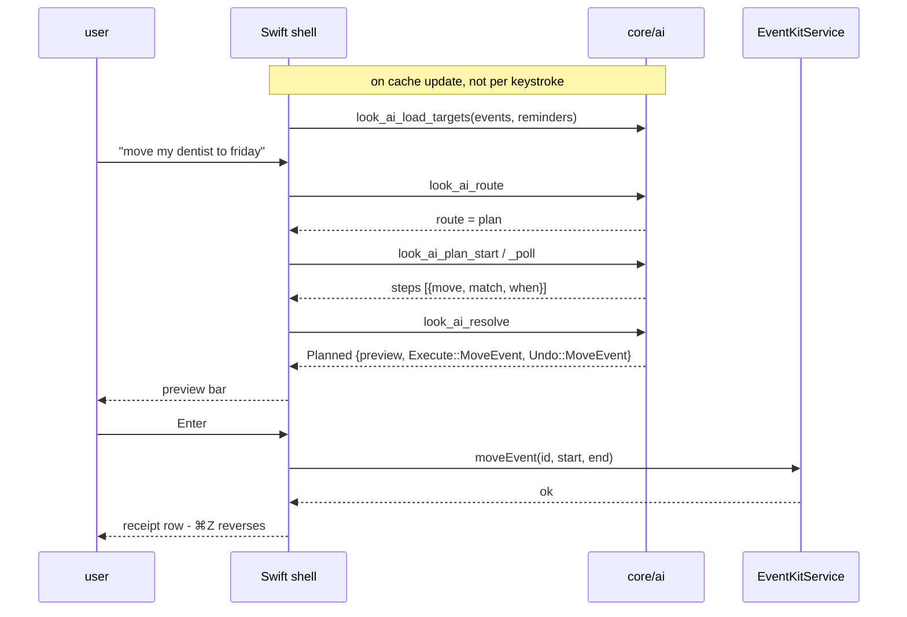

# The EventKit backend (macOS)

Calendar and Reminders are an Apple system framework, so this half is Swift
only (`Support/Calendar/EventKitService.swift`). Rust never knows EventKit
exists: `core/ai` returns `Execute`/`Undo` as data and the shell switches on
it. macOS is the only AI shell and no other is being built; the data-only
split is here because it keeps the testable logic out of a framework that
cannot run unattended, not because a port is coming. A Linux or Windows
backend would be a thinner feature regardless - there is no unified system
calendar to drive on Linux, and Windows restricts programmatic access.

The shared brain, the routing ladder, and the execution spine this plugs into:
`ai-architecture.md`. Why connectors work this way and the platform matrix:
`ai-vision.md`.

Shipped: add (events incl. all-day, reminders), read (schedule answers over a
grammar-parsed window), and mutate (cancel, move, complete, remove, snooze,
block) behind the ambiguity gate, each with a faithful undo. Still open:
recurring-event spans (one occurrence vs the series), and Windows/Linux.

## One request, end to end

Candidates flow the other way: `EventKitService` caches events and reminders
and pushes them into Rust once per cache update via `look_ai_load_targets`
(`syncAITargets`), so matching runs against a warm indexed store rather than a
fresh fetch on every keystroke.

## Permission

One `EKEventStore`, created lazily and reused - creation is expensive.
`CalendarAccess` maps `EKEventStore.authorizationStatus(for:)` onto
`authorized` / `writeOnly` / `notDetermined` / `denied` / `restricted`, folding
`.fullAccess` and legacy `.authorized` into one case. Requests are
`requestFullAccessToEvents()` / `requestFullAccessToReminders()`; the
deployment target is macOS 15, so there is no pre-14 branch.

Usage strings are build settings, since the Info.plist is generated
(`INFOPLIST_KEY_NSCalendarsFullAccessUsageDescription` and the Reminders
equivalent). No sandbox entitlement is needed - the app is not sandboxed.

- **Never prompt on a keystroke.** Only on a confirmed write, or from the
  Settings "Connect Calendar & Reminders" button.
- `.denied` surfaces one line plus a System Settings deep link, never a silent
  failure.
- Reads, `move`, `cancel`, and `block` need full access; `.writeOnly` supports
  the add tools only.

## Per-tool contract

Undo data is captured before the mutation, never reconstructed after it.

| Tool | Execute | Undo |
| --- | --- | --- |
| `calendar.add_event` | `EKEvent`, set title/start/end/`isAllDay`, calendar defaults to `defaultCalendarForNewEvents`, `save(span: .thisEvent)`. Keep `eventIdentifier`. | remove by id |
| `calendar.move_event` | mutate `startDate`/`endDate`, save. Duration is preserved by the resolver. | restore the snapshotted times |
| `calendar.cancel_event` | snapshot title/dates/calendar first, then `remove(span: .thisEvent)` | recreate from the snapshot (new id, identical content) |
| `calendar.block_time` | the resolver already searched free slots over 9-18 working hours, so this is an add | remove by id |
| `reminder.add` | `EKReminder`, `defaultCalendarForNewReminders`, optional `dueDateComponents` | remove by id |
| `reminder.complete` | `isCompleted = true` (sets `completionDate`), save | `isCompleted = false` |
| `reminder.snooze` | replace `dueDateComponents`, save | restore the old components |
| `reminder.remove` | snapshot, then remove | recreate |

All-day events do not block a `block_time` slot, and a day with no clock time
becomes an all-day event rather than an invented hour - both decided in
`core/ai/src/resolve.rs`, not here.

## Safety rules (non-negotiable)

1. No permission prompt on a keystroke; only on a confirmed write or from
   Settings.
2. Never mutate on an ambiguous or unresolvable match. Show the numbered
   candidates, or an honest error.
3. Every write is previewed with literal values and confirmed before execution.
4. Every write produces an undo receipt, and a destructive one snapshots first.
5. Look makes no network calls. Whatever sync the user set up (iCloud, Google,
   Exchange) keeps working because it is the OS's job, not ours.

## Testing

EventKit cannot run unattended - it needs a granted permission and a live
store - so the logic worth testing was moved off it. Resolution, matching, the
ambiguity gate, date computation, previews, and undo recipes are all Rust unit
tests in `core/ai`. `EventKitService` itself is thin enough to smoke-test by
hand: add, confirm it appears in Calendar.app, ⌘Z, confirm it is gone.
